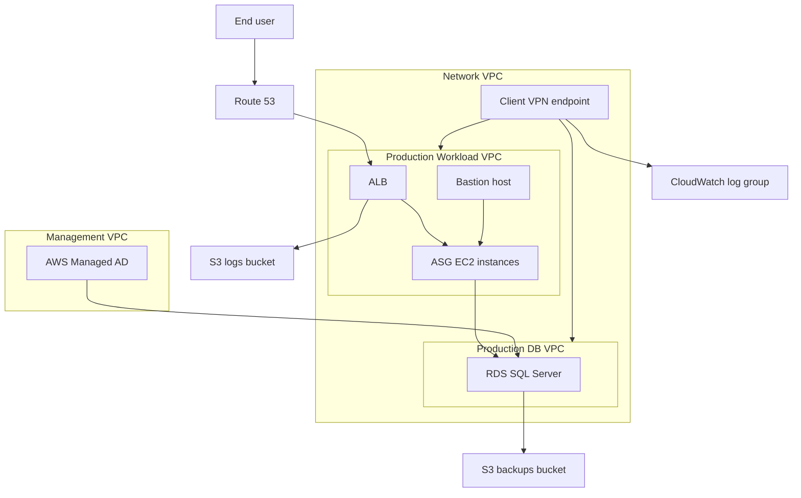

```mermaid
graph TD
    User[End user] --> Route53[Route 53]
    Route53 --> ALB[ALB]

    subgraph Workload_VPC[Production Workload VPC]
        ALB --> ASG[ASG EC2 instances]
        Bastion[Bastion host] --> ASG
    end

    subgraph DB_VPC[Production DB VPC]
        ASG --> RDS[RDS SQL Server]
    end

    subgraph Network_VPC[Network VPC]
        ClientVPN[Client VPN endpoint] --> Workload_VPC
        ClientVPN --> DB_VPC
    end

    subgraph Management_VPC[Management VPC]
        AWSAD[AWS Managed AD] --> RDS
    end

    ALB --> S3Logs[S3 logs bucket]
    RDS --> S3Backups[S3 backups bucket]
    ClientVPN --> CWLogs[CloudWatch log group]
```
